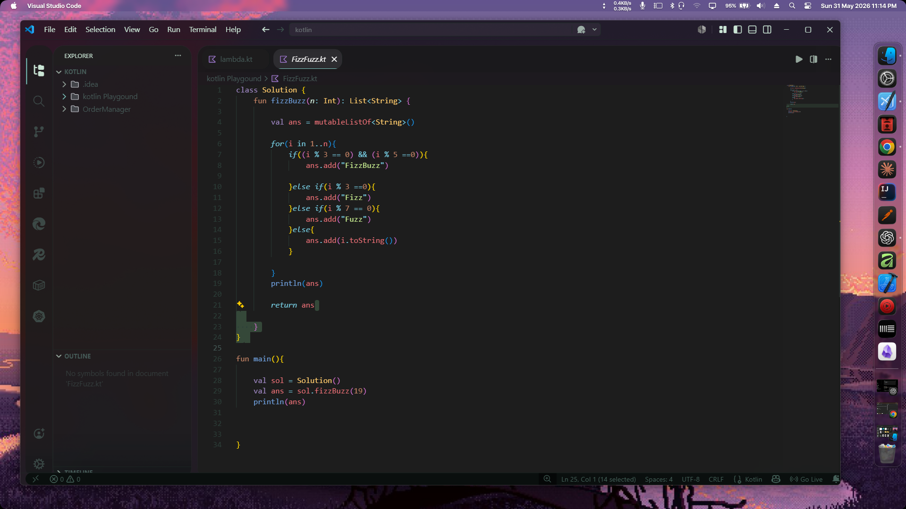
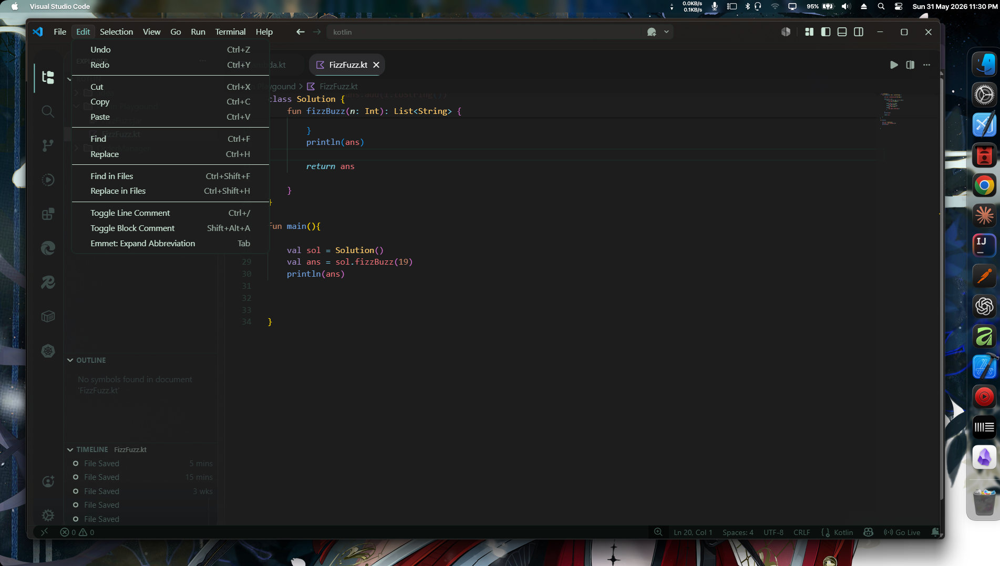
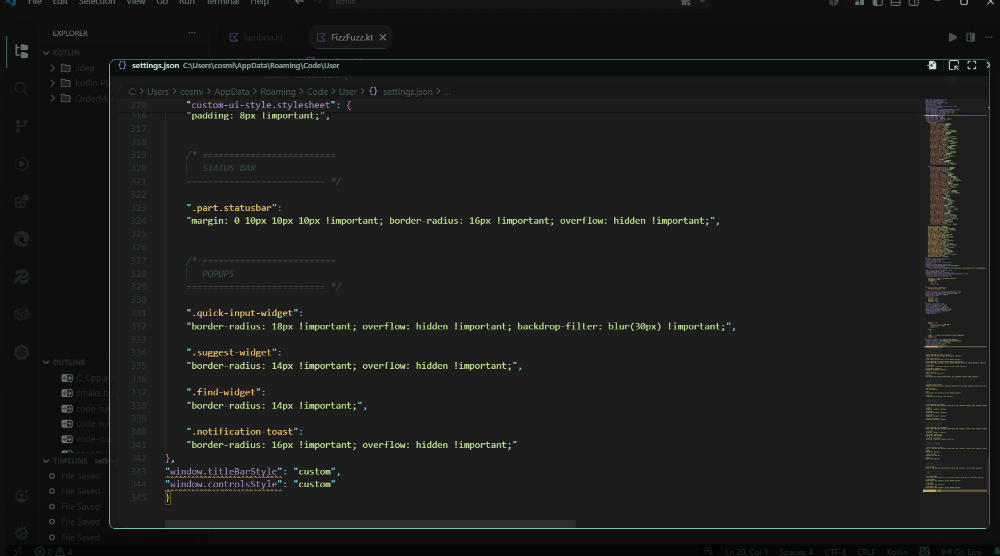
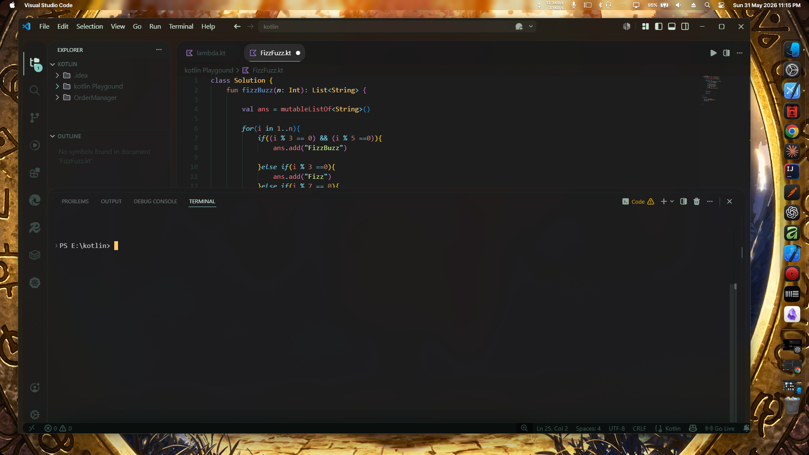

#  Rounded Frosted Glass VS Code Setup

A clean, rounded, frosted-glass VS Code setup with floating editor panels, transparent explorer, custom wallpaper, and a premium aesthetic.

This setup uses **Vira Deepforest**, **Mica For Everyone**, **Custom UI Style**, and a few carefully configured extensions to create a modern workspace.

---

## Preview

### Screenshots






**Features included:**

* Rounded floating editor panels
* Transparent frosted glass explorer
* Rounded terminal with spacing
* Glass activity bar
* Background wallpaper support
* Mica / Acrylic blur
* Vira Deepforest High Contrast theme
* JetBrains icons
* Smooth rounded command palette and popups

---

# Requirements

Before starting, make sure you have:

* **Windows 11** (recommended)
* **Visual Studio Code**
* **Transparency Effects enabled in Windows**
* Basic knowledge of opening `settings.json`

---

# Step 1: Install Visual Studio Code

Download VS Code:

https://code.visualstudio.com/

Install normally.

After installation, open VS Code once.

---

# Step 2: Install Required Extensions

Open Extensions (`Ctrl + Shift + X`) and install the following:

### Required Extensions

#### Theme

* **Vira Theme**
* **JetBrains Icon Theme**

#### UI Styling

* **Custom UI Style**
* **Background**


# Step 3: Install Mica For Everyone

This gives VS Code the premium rounded Windows glass effect.

Download:

https://github.com/MicaForEveryone/MicaForEveryone

Install and open it.

---

## Configure VS Code in Mica For Everyone

Add a rule for:

```text
Code.exe
```

Use these settings:

### Recommended Configuration

```text
Backdrop Type: Acrylic
Corner Preference: Round
Extend Frame: Enabled
Blur Strength: Medium
```

Avoid very aggressive blur settings because they may affect readability.

---

# Step 4: Enable Windows Transparency

Open:

```text
Settings → Personalization → Colors
```

Turn on:

```text
Transparency Effects → ON
```

This is required for the frosted glass look.

---

# Step 5: Open VS Code Settings JSON

Press:

```text
Ctrl + Shift + P
```

Search:

```text
Preferences: Open User Settings (JSON)
```

Open it.

---

# Step 6: Replace Your Settings

Copy the provided `settings.json` from this repository and paste it into:

```text
settings.json
```

Save the file.

---

# Step 7: Change Wallpaper (Optional)

Inside `settings.json`, find:

```json
"images": [
  "C:\\Users\\cosmi\\Downloads\\wallhaven-7jp8qy.jpg"
]
```

Replace it with your own wallpaper path.

### Example

```json
"images": [
  "C:\\Users\\YourName\\Pictures\\wallpaper.jpg"
]
```

Recommended wallpapers:

* Dark forest
* Cyberpunk scenery
* Nature night scenes
* Soft blurred backgrounds

Very bright wallpapers may reduce readability.

---

# Step 8: Reload Custom UI Style

Press:

```text
Ctrl + Shift + P
```

Run:

```text
Custom UI Style: Reload
```

Then run:

```text
Developer: Reload Window
```

Your UI should now transform.

---

# Step 9: Apply Theme

Open Command Palette:

```text
Ctrl + Shift + P
```

Search:

```text
Preferences: Color Theme
```

Choose:

```text
Vira Deepforest High Contrast
```

Then choose icon theme:

```text
vscode-jetbrains-icon-theme-2023-dark
```

---

# Included Features

### Floating Rounded Editor

The editor uses rounded corners and subtle blur to create a floating panel appearance.

### Frosted Glass Sidebar

Explorer and activity bar use transparency with blur.

### Rounded Terminal

Terminal panel includes spacing and rounded corners for a cleaner appearance.

### Background Wallpaper

Custom wallpaper support is enabled through the Background extension.

### Rounded Popups

Command palette, notifications, and suggestions are rounded for consistency.

---

# Troubleshooting

## Blur Not Working

Make sure:

* Windows transparency is ON
* Mica For Everyone is running
* Custom UI Style extension is installed
* You reloaded VS Code

Run:

```text
Custom UI Style: Reload
```

---

## Sidebar Is Not Transparent

Try:

```text
Developer: Reload Window
```

If still broken:

Disable conflicting extensions like:

* APC UI
* Vibrancy
* Old custom CSS injectors

---

## Menus Not Clickable

This usually happens due to conflicting UI extensions.

Disable:

```text
Vibrancy
```

and reload VS Code.

---

## Rounded Corners Not Applying

Run:

```text
Custom UI Style: Reload
```

Then restart VS Code completely.

---

## UI Looks Broken

Sometimes VS Code updates break injected CSS.

Fix:

1. Disable Custom UI Style
2. Reload VS Code
3. Re-enable it
4. Reload again

---

# Recommended Settings

For best results:

### Window

* Acrylic blur
* Rounded corners
* Custom title bar

### Theme

```text
Vira Deepforest High Contrast
```

### Icons

```text
JetBrains Icon Theme
```

### Wallpaper

Use darker wallpapers for readability.

---

# Performance Tips

If VS Code feels laggy:

Disable:

```json
"terminal.integrated.gpuAcceleration": "off"
```

Reduce wallpaper opacity:

```json
"opacity": 0.2
```

Avoid installing multiple UI modification extensions together.

---

# Credits

Built using:

* VS Code
* Vira Theme
* Custom UI Style
* Background Extension
* Mica For Everyone

---

Enjoy your premium frosted glass workspace ✨
